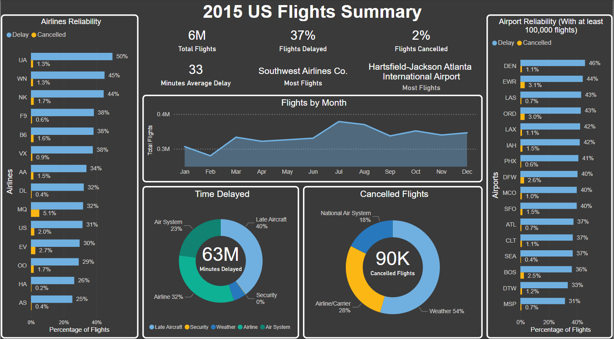
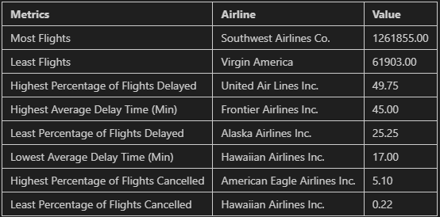
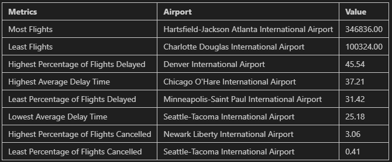
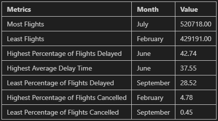
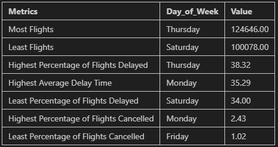
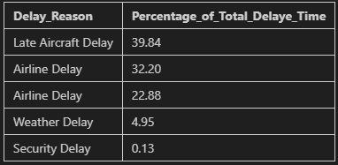

# Airport Delays Analysis

## Overview
This repository contains a SQL script for analyzing airport delays.The goal of this project is to provide insights into flight delays at various airports, identifying patterns and trends. The data used in this project is from the US Department of Transportation and contains information on all flights in the US in 2015.

## Features
The SQL script contains the following features:
- Total number of flights
- Total Cancelled flights
- Percentage of flights that were cancelled
- Percentage of flights that were delayed
- Average delay time
- Top 5 arilines with most and least flights
- Summary of metrics by carrier
- Top 5 airports with most and least flights
- Summary of metrics for aiports with at least 100,000 flights
- Monthly summary of metrics
- Day of the week summary of metrics
- Distribution of delays by reason
- Distribution of cancellations by reason

## Power BI Dashboard Screenshot

## SQL Results Screenshot
#### Airline Summary

#### Airport Summary

#### Monthly Summary

#### Day of the Week Summary

#### Delay Distribution

#### Cancellation Distribution

